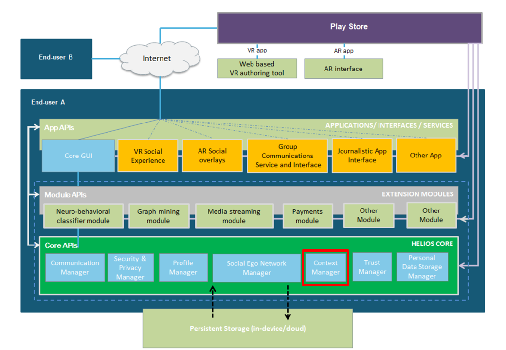

# ContextManager core module

# Helios Context Management API

## Introduction ##

The Context manager module handles context-related monitoring and reasoning for the user. It provides a framework for implementing context types and context detection with core implementations. New context types can be introduced by extending the provided base class implementations. The context manager can access sensors with the help of a separate Sensor Manager as well as other context sources.

The Context Management API provides methods to accessing and managing context information.

HELIOS Context Management API of ContextManager is one of the HELIOS Core APIs as highlighted in the picture below:

## API usage ##

See javadocs in [javadocs.zip](doc/javadocs.zip).

### Examples of API usage ###

- See the source folder: "app/src/main/java/eu/h2020/helios_social/core/context_example1/"
- A *LocationContext* example - "ContextExample1.java" (Android app)
    - see the description: [ContextExample1.pdf](doc/ContextExample1.pdf)
    - shows how to create two contexts "at work" and "at home". In addition, it shows 
    how to relate the created contexts to CEN (contextual ego network), and how to use profile information within the contexts
    - this example application depends on the modules: eu.h2020.helios_social.core.profile and eu.h2020.helios_social.core.contextualegonetwork
- *ActivityContext* - "ActivityContextExample1.java" shows how to create contexts for different activity types: "Walking", "In vehicle", ... 
- *WifiContext* - A wifi-based context (see "WifiContextExample1.java")
- *BluetoothLESensor* - A bluetooth LE sensor example ("BluetoothLESensorExample1.java")
- *DeviceSensor* - An example how to use the class DeviceSensor, which provides methods to use Android devices build-in sensors 
            that measure motion, orientation, and various environmental conditions ("DeviceSensorExample1.java").
- [how to build the example application.](doc/building.md)

A description on how to create a new context type:
- [creating a time-based context](doc/creatingContext1.md)

### Base classes and interfaces: ###

- see the class diagram: [class_diagram.png](doc/images/context_baseclasses.png)

## Android Studio project structure ##

This Android Studio project contains the following components:

* app - Context test application

* doc - Additional documentation files

* lib - Context module and API implementation
